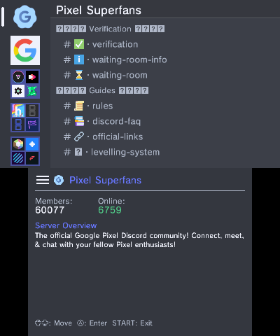
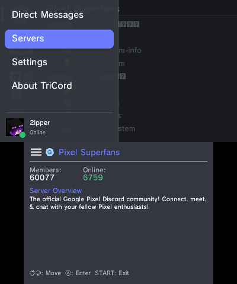
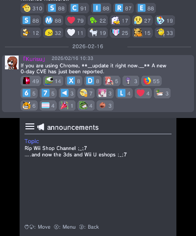

# TriCord


[](https://discord.gg/quYy9fK8tJ)

Discord client for Nintendo 3DS.

## Disclaimer

> **This project is developed for educational purposes only.**
> This is an unofficial Discord client and is not affiliated with or endorsed by Discord Inc.

This software is provided **"as is"**, and you use it at your own risk. The use of this application is entirely the user's own responsibility. The developers assume no responsibility for:
* Any damages, data loss, or account-related issues.
* Violations of Discord's **Terms of Service (ToS)** resulting from the use of this software.

## Screenshots





## Features
- QR code and email/password authentication
- Text messaging with emoji, attachments, embeds, reactions, and replies
- Multi-account support
- Server, channel, and forum thread navigation
- Customizable themes and internationalization (EN/JA)

## Installation
1. Download the latest release (CIA or 3DSX)
2. Install via FBI (CIA) or place in `/3ds/` (3DSX)
3. Launch and log in with QR code or email/password

### ⚠️ Security Notice
The account information is stored in `/3ds/TriCord/accounts`. **Although this file is encrypted, never share it with others.** Sharing this file may allow unauthorized access to your Discord account.

## Building from Source

### Prerequisites
- [devkitPro](https://devkitpro.org/wiki/Getting_Started) with devkitARM

### Build

```bash
git clone https://github.com/2b-zipper/TriCord.git
cd TriCord
make -j$(nproc)
```

Output: `TriCord.3dsx`, `TriCord.cia`, `TriCord.elf`

## Libraries

### devkitPro Libraries (via devkitPro pacman)
- [libctru](https://github.com/devkitPro/libctru) (zlib License)
- [citro3d](https://github.com/devkitPro/citro3d) (zlib License)
- [citro2d](https://github.com/devkitPro/citro2d) (zlib License)
- [libcurl](https://curl.se/libcurl/) (curl License)
- [mbedtls](https://github.com/Mbed-TLS/mbedtls) (Apache-2.0 OR GPL-2.0-or-later)
- [zlib](https://zlib.net/) (zlib License)

### Bundled Libraries (included in `library/`)
- [RapidJSON](https://github.com/Tencent/rapidjson) (MIT License)
- [stb_image](https://github.com/nothings/stb) (Public Domain / MIT License)
- [qrcodegen](https://github.com/nayuki/QR-Code-generator) (MIT License)

### Additional Resources
- CA bundle: [cacert-2025-12-02.pem](https://curl.se/docs/caextract.html) (Mozilla's CA certificate bundle)
- [Twemoji](https://github.com/jdecked/twemoji) (CC-BY 4.0 / MIT License)

## Usage

**DM/Server/Channel List**
- D-Pad: Navigate | A: Select | B: Back

**Message View**
- D-Pad: Scroll | B: Back | X: Open Menu | Y: Text input

**General**
- Start: Exit the app | Select: Open the hamburger menu | L+R: Toggle Debug Log

Config: `sdmc:/3ds/TriCord/config.json`

## License
This project is licensed under the GNU General Public License v3.0 - see the [LICENSE](LICENSE) file for details.

## Credits
- [2b-zipper](https://github.com/2b-zipper) for the main development
- [Str4ky](https://github.com/Str4ky) for the French translation
- [AverageJohtonian](https://github.com/AverageJohtonian) for the Spanish translation
- [Discord Userdoccers](https://github.com/discord-userdoccers/discord-userdoccers) for the documentation of the Discord API
- And all other contributors!

## Support
If you encounter any issues or have questions:
- Join our [Discord server](https://discord.gg/quYy9fK8tJ)
- Open an issue on [GitHub Issues](https://github.com/2b-zipper/TriCord/issues)
- Check existing issues for solutions
